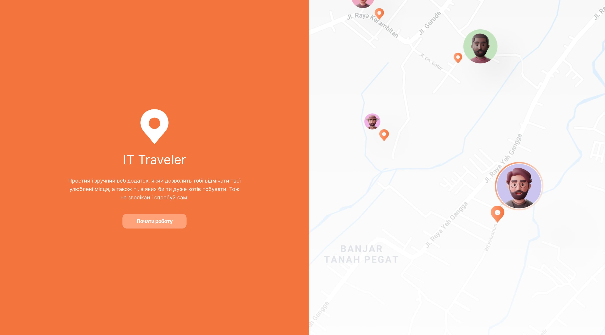

# IT Traveler

**[VIEW DEMO](https://vuejs-it-traveler-01.vercel.app/)**

---

A simple and convenient web application that will allow you to mark your favorite places, as well as those that you would really like to visit. So don't delay and try it yourself!

---

## Recommended IDE Setup

[VSCode](https://code.visualstudio.com/) + [Volar](https://marketplace.visualstudio.com/items?itemName=Vue.volar) (and disable Vetur).

## Dependencies and technologies

- _Vite_
- _JavaScript_
- _Vue 3_
- _Vue Router_
- _Axios_
- _MapBox_
- _Tailwind CSS_

... and more. Full list of dependencies and additional information is available in **`package.json`** file.
